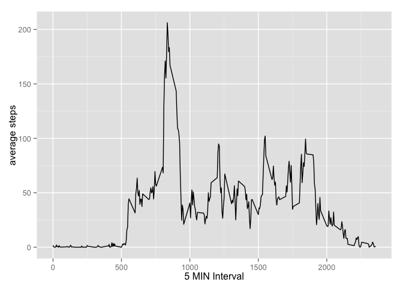
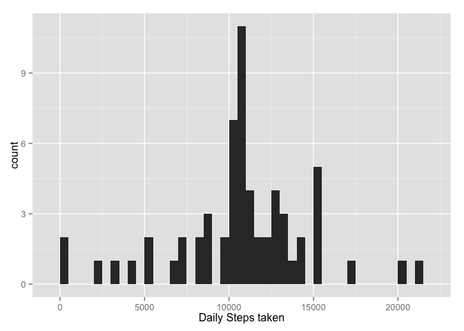
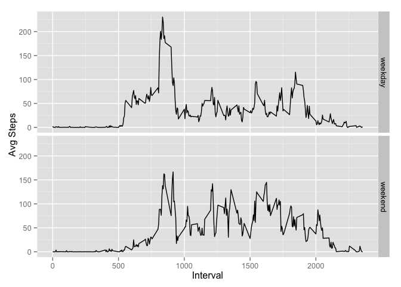

# Reproducible Research Assignment 1
Betty Yeo  
14 December 2014  
# Reproducible Research

## Loading and preprocessing the data


```r
activitylist <- read.csv("activity.csv")
```

## What is mean total number of steps taken per day?


```r
totalSteps <- tapply(activitylist$steps, activitylist$date, sum,na.rm=TRUE)
hist(totalSteps,xlab="No of Steps")
```

 


## Mean and median of the total steps 


```r
mean(totalSteps,na.rm=TRUE)
```

```
## [1] 9354.23
```

```r
median(totalSteps,na.rm=TRUE)
```

```
## [1] 10395
```

## Average Number of Steps

Make a time series plot (i.e. type = "l") of the 5-minute interval 
(x-axis) and the average number of steps taken, 
averaged across all days (y-axis)


```r
library(ggplot2)
avgStep <- aggregate(x = list(steps = activitylist$steps), by = list(interval = activitylist$interval), 
                      FUN = mean, na.rm = TRUE)

ggplot(data = avgStep, aes(x = interval, y = steps)) + geom_line() + xlab("5 MIN Interval") +  ylab("average steps")
```

 

The maximum average number of steps across all days:


```r
avgStep[which.max(avgStep$steps),]
```

```
##     interval    steps
## 104      835 206.1698
```

Calculate and report the total number of missing values in the dataset
(i.e. the total number of rows with NAs)


```r
sum(is.na(activitylist$steps))
```

```
## [1] 2304
```
## Filling in  missing values


```r
mergedlist <-merge(activitylist,avgStep, "interval")
colnames(mergedlist) <- c('interval',"steps","date","avgStep")

sum(is.na(mergedlist$steps))
```

```
## [1] 2304
```

```r
for (i in 1:nrow(mergedlist)){
  if(is.na(mergedlist$steps[i])){
    mergedlist$steps[i]<- mergedlist$avgStep[i]
  }
}
```

Make a histogram of the total number of steps taken each day and 
Calculate and report the mean and median total number of steps taken per day. 
Do these values differ from the estimates from the first part of the assignment? 
What is the impact of imputing missing data on the estimates of the total daily number of steps?


```r
library(ggplot2)
totalSteps2 <- tapply(mergedlist$steps, mergedlist$date, sum,na.rm=TRUE)
qplot(totalSteps2, xlab="Daily Steps taken", binwidth=500)
```

 

```r
mean(totalSteps2,na.rm=TRUE)
```

```
## [1] 10766.19
```

```r
median(totalSteps2,na.rm=TRUE)
```

```
## [1] 10766.19
```

## Difference between Weekday and Weekend
Create a new factor variable in the dataset with two levels weekday and weekend 
indicating whether a given date is a weekday or weekend day.


```r
mergedlist$date <-as.Date(mergedlist$date)
mergedlist$days <- factor(format(mergedlist$date, "%A"))

v1 <-vector()
for (i in 1:nrow(mergedlist)){
if(mergedlist$days[i] %in% c("Monday", "Tuesday", "Wednesday", "Thursday", "Friday"))
  v1[i] <-"weekday"
  else if (mergedlist$days[i] %in% c("Saturday", "Sunday"))
    v1[i] <-"weekend"
}
mergedlist$day<-v1
```


Make a panel plot containing a time series plot (i.e. type = "l") 
of the 5-minute interval (x-axis) and the average number of steps taken, 
averaged across all weekday days or weekend days (y-axis). 


```r
avgStep4Mergedlist <- aggregate(steps~interval+day, data=mergedlist,mean)
ggplot(avgStep4Mergedlist, aes(interval,steps))+geom_line()+facet_grid(day~.)+
  xlab("Interval")+ylab("Avg Steps")
```

 


